云计算的定义

云是网络、互联网的一种比喻说法，即互联网与底层基础设施的抽象体。“计算”指计算机提供的计算服务(包括各种功能，资源，存储)，云计算可以理解为通过互联网可以使用足够强大的计算机为用户提供服务，这种服务的使用量可以使用统一的单位来描述

1、计算发展史

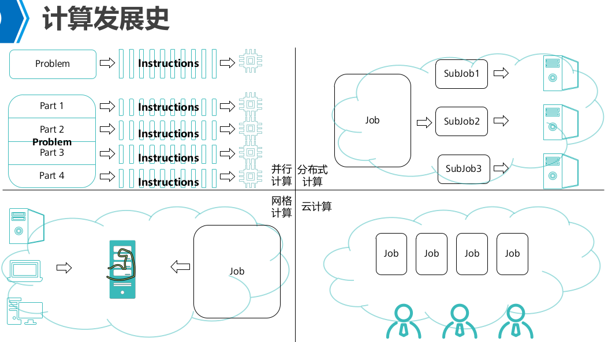

2、云计算的服务模式

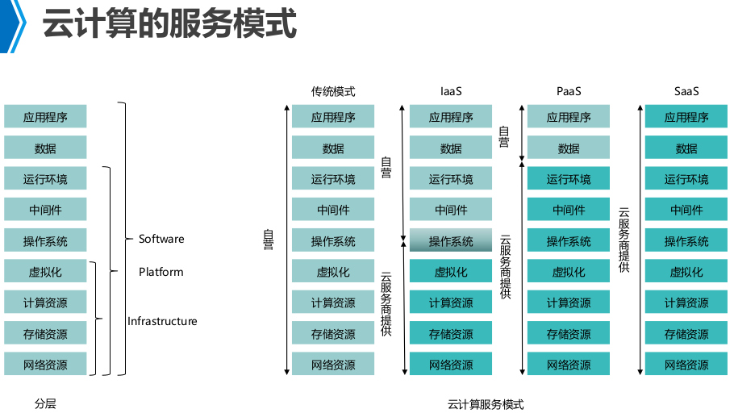

３、计算虚拟化的分类
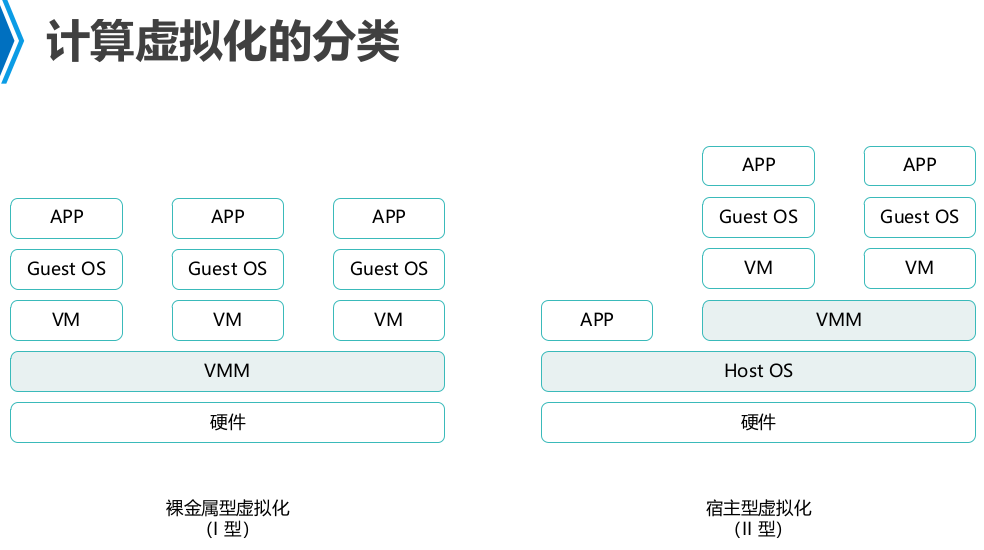

4、Xen 和KVM

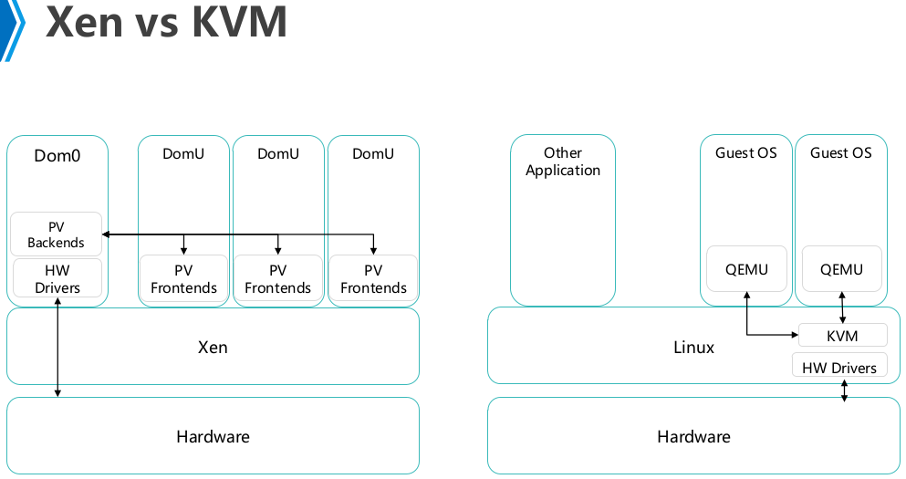

5、KVM是什么？

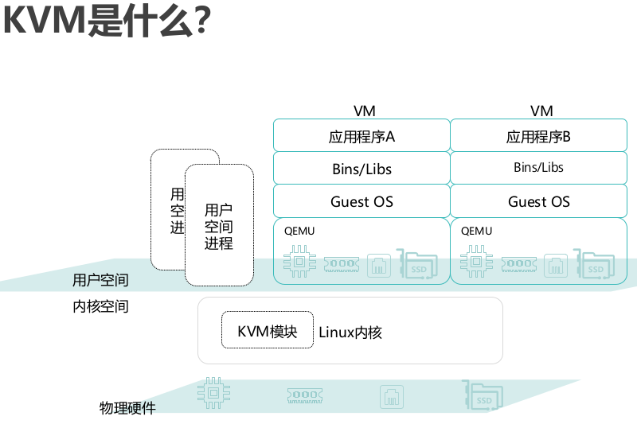

6、KVM体系架构

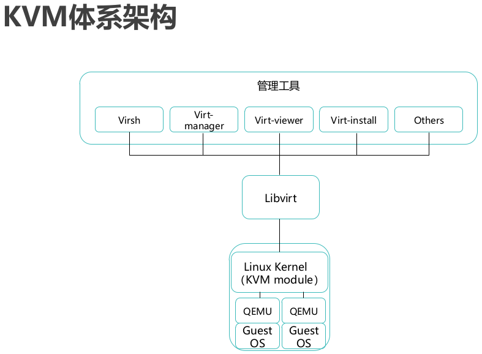

7、KVM I/O操作流程

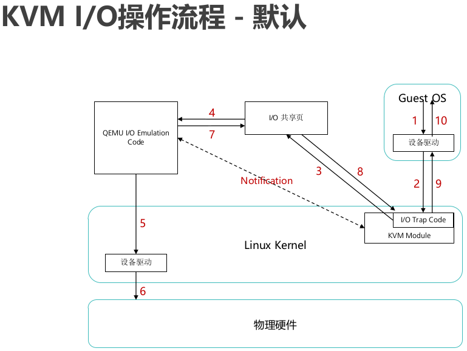

8、KVM I/O Virtio

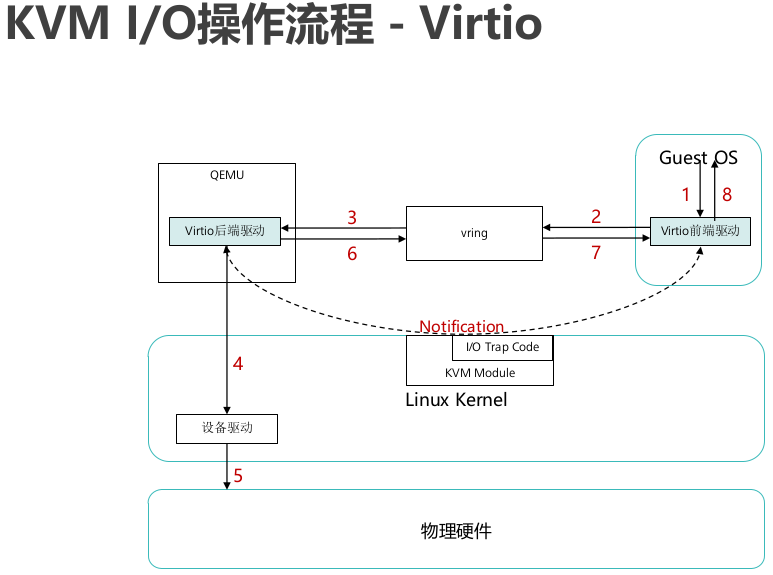

9、常用RAID类型
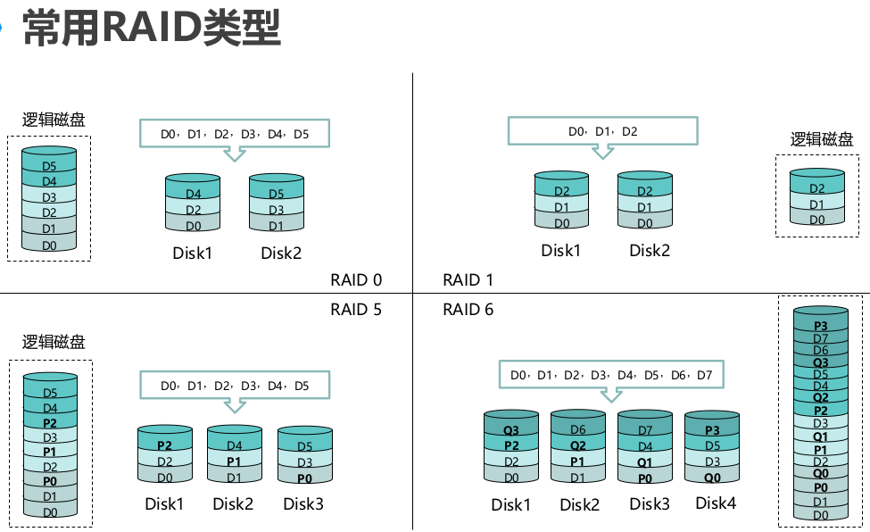

10、IP SAN 和FC SAN
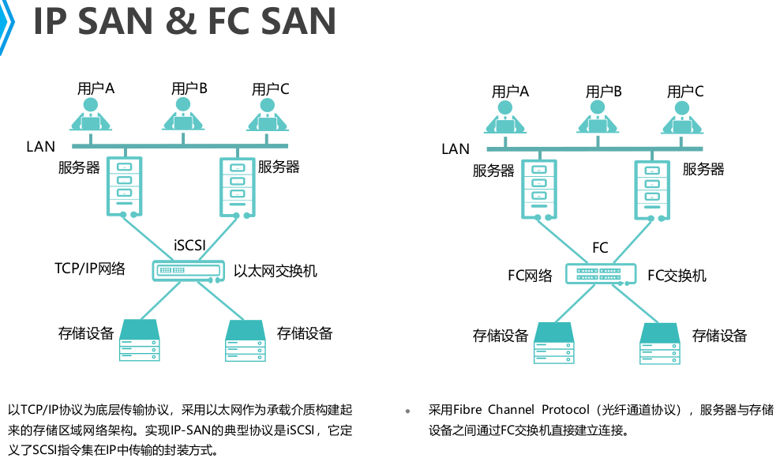

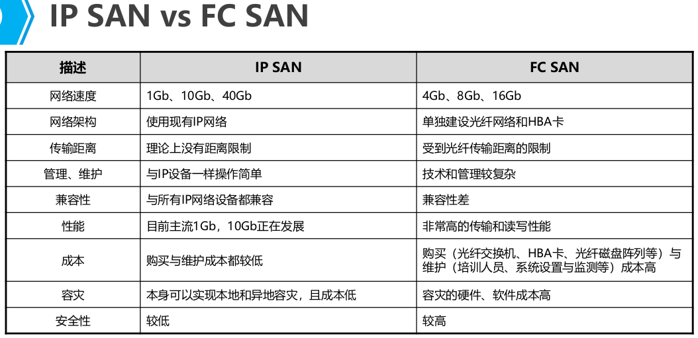

11、NAS架构

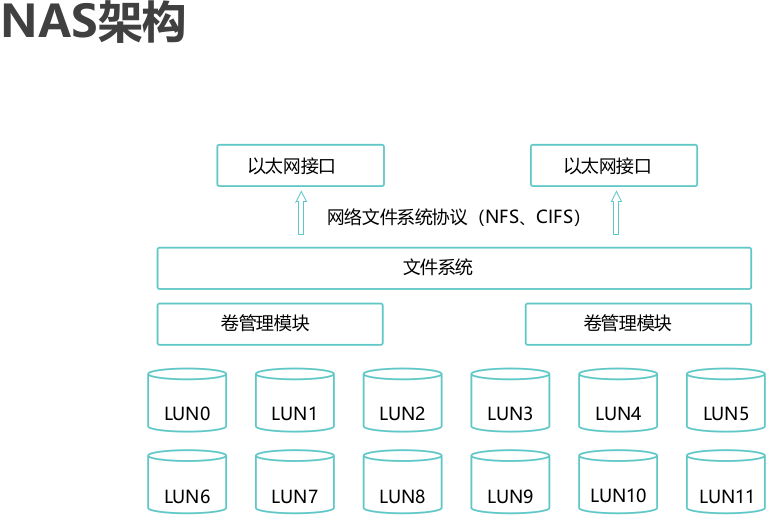

12、RAID和LUN关系

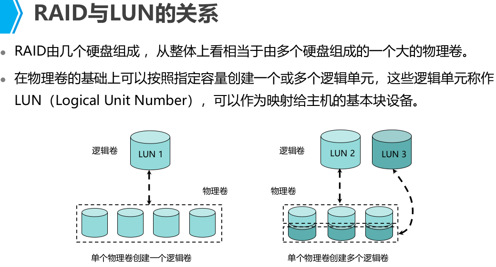

13、虚拟化集群特征(4)

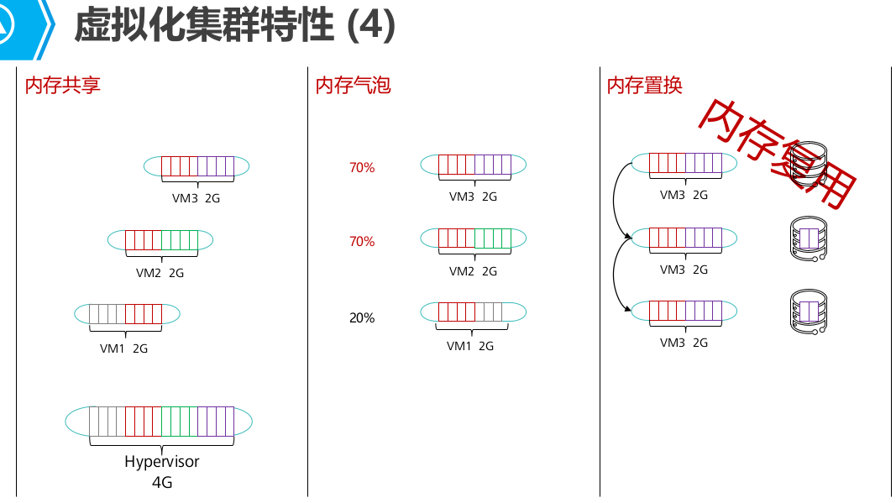

14、　云计算延伸

- 雾计算 Fog Computing数据处理和应用程序集中在网络边缘设备中。
- 边缘计算 Edge Computing是指在靠近物或数据源头的一侧，采用网络、计算、存储、应用核心能力为一体的开放平台，就近提供最近端服务。边缘计算应用场景(ITS智慧交通、智能家居、超清视频监控)，低延迟，高带宽
- 微服务　将单个应用程序作为一套小型服务开发的方法，每种应用在自己的进程中运行，并与轻量级机制(通常是http资源API通讯)，这些服务是围绕业务功能构建的，可以通过全自动部署机制独立部署。
- 无服务器Serverless是一种构建和管理基于微服务架构的完整流程，允许在服务部署级别而不是服务器部署级别来管理应用部署。
>> FaaS Function as a service 函数即服务　服务商提供一个平台，客户开发、运行和管理应用程序功能，而无需构建和维护基础架构
>> BaaS Backend as a service　后端即服务　服务商为移动应用开发者提供整合云后端的边界服务。是连接移动应用和它的后端系统的新模型

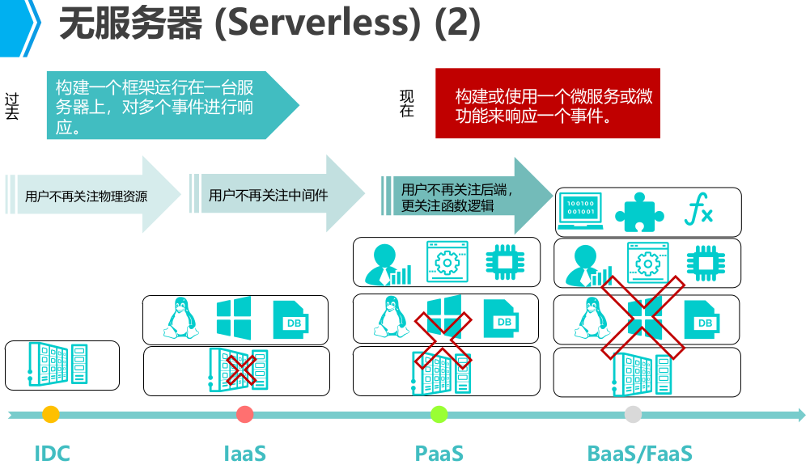
- 