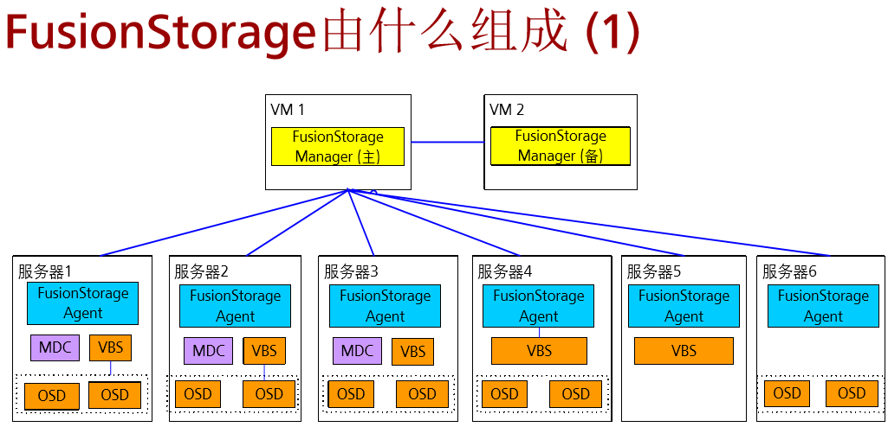

FusionCompute 
- 主机是FusionCompute的躯干，安装了虚拟化操作系统的服务器，主机直接向云资源池提供计算资源，包括CPU，内存
- VRM是FusionCompute的大脑，对云资源池进行管理和协调，使云资源池中的资源能够被合理利用，确保各资源处于最佳状态。

FusionCompute提供功能
- 虚拟机动态调整
- 虚拟存储精简置备
-　网络I/O控制
-　虚拟机热迁移
-　虚拟机快照
-　分布式虚拟交换机

FusionManager 是华为一个统一资源平台管理使能器，以云服务自动化管理和资源智能运维为核心，为用户提供“便捷，精简”的云数据中心管理体验

FusionManager管理虚拟和资源池，FusionCompute提供服务器虚拟化，并将CPU，内存，存储加入到资源池中

什么是FusionStorage 分布式块存储软件

FusionStorage组成部分
---

- FusionStorage Manager(FSM) FusionStorage管理模块，提供告警、监控、日志、配置等操作维护功能，一般情况下主备部署
- FusionStorage Agent(FSA)　代理进程，部署在节点上，实现各个节点与FSM通讯，FSA包含MDC,VBS和OSD三种不同进程
>> MDC(MetaData Controller) 元数据控制，实现对分布式集群状态控制，以及控制数据分布式规则、数据重建规则等。MDC默认部署在３个节点的ZK(ZooKeeper)盘上，形成MDC集群
>> VBS(Virtual Block System) 虚拟块存储管理软件，负责卷元数据的管理，提供分布式集群接入点服务，使计算资源能够通过VBS访问分布式存储资源。每个节点默认部署一个VBS进程，形成VBS集群。
>> OSD(Object Storage Device)　对象存储设备服务，执行具体的I/O操作。在每个服务器上部署多个OSD进程，一块磁盘默认对应部署一个OSD进程。在SSD做主存时，为了充分发挥SSD的性能，可以在一块SSD上部署多个OSD进程。

FusionStorage与传统存储设备对比
---

- 高扩展性　容量与性能线性增加
- 高性价比 支持融合部署，通用X86服务器堆叠扩展，节约成本；网络扁平化，扩容简单
- 高可靠性　故障业务无影响；自动数据重建与恢复
- 并行快速数据重建　１T数据重建小于10分钟

FusionCloud私有云解决方案介绍
---

FusionCloud构筑一云、一湖、一平台，加速应用云化与创新
- 一平台(创新业务云化)　容器、虚拟机应用混合排编，业务模板支持复杂业务自动化发放；CSC支持第三方应用的服务化接入
-　一湖(数据能力云化)　融合大数据，统一引擎；大数据服务秒级自动发放，快速构筑数据平台能力
-　一云(传统业务云化)　云内:一云多池，云边:云边协同，业务统一发放和运维；云间:无缝混合云

三种不同类型的FusionSphere Region
---

- 基础设施与资源池FusionSphere(Region Type I) 软SDN
>>网络资源池包含(L3-L7虚拟网络；L2虚拟交换)

- 基础设施与资源池FusionSphere(Region Type II) 硬件SDN
>>网络资源池包含(SDN控制器；L3-L7虚拟网络；L2虚拟交换)

- 基础设施与资源池FusionSphere(Region Type III) 无SDN
>> 网络资源池包含(L2虚拟交换)

ManageOne云管理
---

ManageOne在解决方案中承担CMP(Cloud Management Platforms)职责，为企业提供对企业私有云资源及企业租用的公有云资源统一管理的能力。包括租户管理、云产品管理、产品目录，计量，计算、存储和网络资源自动化配置，云资源和云服务的运维监控等

FusionSphere6.3虚拟化特性介绍
---

- 兼容行业特殊系统(windows Redhat SuSeLinux 中标麒麟)
- 灵活的管理架构，规模大小自如
- 支持GPU硬件虚拟化
- 在线调整CPU和内存
- 内存复用技术，提高30%虚拟机密度(内存共享，写时复制、内存置换(长时间未访问的数据写入磁盘并建立映射，虚拟机再次访问时置换回来)、内存气泡(将较为空闲的虚拟机内存释放给内存使用率高的虚拟机，提高内存使用率))
- 基于NUMA架构的亲和性调度(CPU优先使用同一个node上的内存)
- 存储自动精简配置，大幅减少存储投资
- 虚拟卷在线扩容(VHD Virtual Hard Disk Formart)
- 存储资源裸设备映射(RDM)RDM为虚拟机提供了直接访问存储子系统(光纤通道或iSCSI)上的LUN，通过使物理设备映射，让虚拟机识别SCSI磁盘
- 虚拟机快照(支持增量快照和内存快照，支持live备份，快照live合并)
- VIMS虚拟集群存储文件系统
- 网卡自动适应中断聚合，提供效率达30%(技术特点：优化单线程网络报文处理机制，采用多线程、无锁技术，提供并发性能，提高30%的包接收/发送性能)
- 10GE网卡支撑关键应用和IO密集型场景(用户态转换:DPDK技术加速报文转发；大页内存技术减少报文拷贝次数。SR-IOV:Hypervisor无需进行地址转换，缺点损失热迁移快照等特性)
- 分布式虚拟交换机　集中配置管理界面，支持VLAN 二层安全策略、网络带宽控制等
- 主机上行端口支持LACP链路聚合(基于IEEE 802.ad标准的LACP协议实现，手动链路聚合和静态链路聚合)
- 虚拟机网络Qos控制
- 虚拟机热迁移技术(VM Motion)基于内存压缩技术，热迁移效率提高一倍，支持源目的主机是异构CPU场景下的虚拟机热迁移
- 虚拟机克隆　当使用VIMS ，FusionStorage存储时，可以在线和离线克隆虚拟机
- 虚拟机HA机制(故障检测和恢复)
- 动态资源调度DRS　自动实现集群内虚拟机负载相对平衡
- 分布式电源管理DPM 将低负载服务器上的虚拟机迁走并将服务器下电，DPM和DRS应该同时处理，避免两种功能相互影响
- QoS精细化资源管控，保障VIP业务可用(业务有效)
- 数据保护机制　主备、多重备份
- eBackup虚拟机备份方案　支持永久增量备份，一套系统最大可保护1万台虚拟机，一套系统最大支持64个服务器，支持多站点备份
- 用户剩余信息彻底清除不留痕　物理bit清零
- 系统精简加固，提升安全　OS组件裁减；内核裁减；系统安全加固:加固端口、访问权限等；
- 网络隔离安全　不同组用户虚拟机通过VLAN隔离；管理面、存储面、业务面隔离
- 帐号安全管理　账户生命周期管理；复杂度策略管理；遵从账户－角色模型，每个角色分权，分域
- 兼容主流硬件和操作系统
- 兼容华为全系列硬件产品

