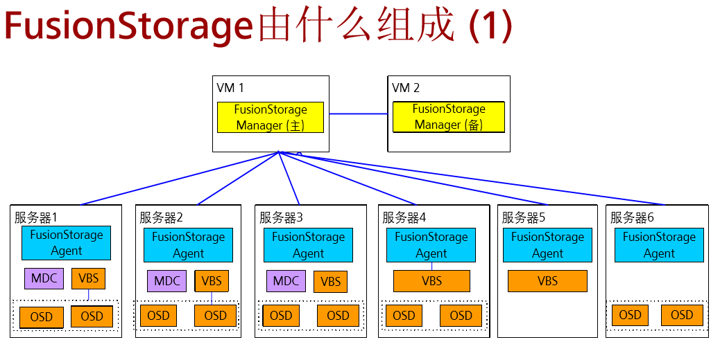

FusionCompute 
- 主机是FusionCompute的躯干，安装了虚拟化操作系统的服务器，主机直接向云资源池提供计算资源，包括CPU，内存
- VRM是FusionCompute的大脑，对云资源池进行管理和协调，使云资源池中的资源能够被合理利用，确保各资源处于最佳状态。

FusionCompute提供功能
- 虚拟机动态调整
- 虚拟存储精简置备
-　网络I/O控制
-　虚拟机热迁移
-　虚拟机快照
-　分布式虚拟交换机

FusionManager 是华为一个统一资源平台管理使能器，以云服务自动化管理和资源智能运维为核心，为用户提供“便捷，精简”的云数据中心管理体验

FusionManager管理虚拟和资源池，FusionCompute提供服务器虚拟化，并将CPU，内存，存储加入到资源池中

什么是FusionStorage 分布式块存储软件

FusionStorage组成部分
---

- FusionStorage Manager(FSM) FusionStorage管理模块，提供告警、监控、日志、配置等操作维护功能，一般情况下主备部署
- FusionStorage Agent(FSA)　代理进程，部署在节点上，实现各个节点与FSM通讯，FSA包含MDC,VBS和OSD三种不同进程
>> MDC(MetaData Controller) 元数据控制，实现对分布式集群状态控制，以及控制数据分布式规则、数据重建规则等。MDC默认部署在３个节点的ZK(ZooKeeper)盘上，形成MDC集群
>> VBS(Virtual Block System) 虚拟块存储管理软件，负责卷元数据的管理，提供分布式集群接入点服务，使计算资源能够通过VBS访问分布式存储资源。每个节点默认部署一个VBS进程，形成VBS集群。
>> OSD(Object Storage Device)　对象存储设备服务，执行具体的I/O操作。在每个服务器上部署多个OSD进程，一块磁盘默认对应部署一个OSD进程。在SSD做主存时，为了充分发挥SSD的性能，可以在一块SSD上部署多个OSD进程。

FusionStorage与传统存储设备对比
---

- 高扩展性　容量与性能线性增加
- 高性价比 支持融合部署，通用X86服务器堆叠扩展，节约成本；网络扁平化，扩容简单
- 高可靠性　故障业务无影响；自动数据重建与恢复
- 并行快速数据重建　１T数据重建小于10分钟
